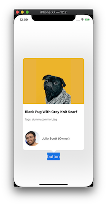

# PopTip

PopTip is a simple application that shows a tooltip attached on a view. Tooltip is shown a few seconds after application load or can be triggered on the push of the button.

See [ToolTipControl](https://github.com/arvinq/ToolTipControl) framework repository for more information

### Screenshot

